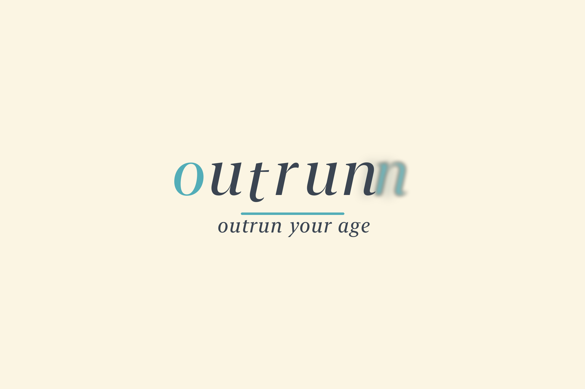

# outrunn

**outrun your age**

Built by: Amulya Bisaria, Anish Koduri, Krish Hariharan, and Srivanth Rudrangi for HackRice 16

outrunn is an iOS app that estimates Real, Biological, Cardiac, and Pulmonary age from a phone-camera Presage scan plus Apple Health (or demo) vitals, then turns those numbers into a recovery plan. Local models own the math. Gemini interprets the same numbers on demand. It does not watch the video.

<p align="center">
  
</p>

This repo is the HackRice 16 iOS app (`outrunn.app`, bundle id `com.krish.outrun`).

**Public repo:** keep keys out of git. See [SECURITY.md](SECURITY.md). If you cloned an older commit that still had live keys, rotate them.

---

## What it does

1. **Scan after activity.** Dash opens a Presage SmartSpectra camera session. The scan records heart-rate recovery, respiratory rate, camera heart rate, signal quality, and Baevsky stress.
2. **Chart the ages.** Dash graphs Real, Biological, Cardiac, and Pulmonary age over 1D / 1W / 1M / 6M / 1Y from stored `AgeReading`s.
3. **Explain and plan.** Insights sends a numbers-only JSON snapshot to Gemini when the user taps **Repopulate**. The reply is a structured `CoachPlan`: why the ages moved, scan vs wearables, study notes, and actions for today, this week, training, recovery, long-term healthspan, and supplements.
4. **Ask roadrunner.** Local routing answers “where is X / explain this screen.” Interpretive questions go to Gemini, capped at **8 Gemini asks per day**. Chat is not persisted.
5. **Inspect the data.** Data shows peer-relative risk, last-scan snapshot stats, and year deltas each factor adds or removes.
6. **Keep history.** History lists scans and age readings. Settings can reset today, this week, or all time.
7. **Connect sources.** Add links Apple Health, Garmin-style telemetry, Fitbit, or manual entry. Settings holds name, chronological age, and account.

Not a diagnosis. Not medical advice.

---

## Design

The UI is a thin SwiftUI shell. One observable `UserRecoveryState` is the source of truth. Tabs do not recompute ages on their own.

```
Splash → Sign in → optional wearable setup → Main shell
                                              ├─ Dash      scan + age charts
                                              ├─ Data      risk, snapshot, year deltas
                                              ├─ Insights  Gemini plan + roadrunner
                                              ├─ History   readings
                                              └─ Add       HealthKit / wearables
```

| Layer | Role |
| --- | --- |
| **Views** | Layout and user actions. `MainShellView` keeps all five tabs mounted and toggles hit-testing so state survives tab switches. |
| **`UserRecoveryState`** | Ages, scans, Health context, habits, coach plan, risk, persistence key. `@Observable`. |
| **`ClinicalRiskEngine`** | Published relative-risk functions (HRR, resting HR, HRV, age acceleration). |
| **`GeminiCoach`** | On-demand plan + roadrunner. Numbers in, structured plan out. Never video. |
| **`RoadrunnerGuide`** | Local “where / explain” answers that do not spend Gemini quota. |
| **`HealthKitManager`** | Read-only HealthKit: HRV, resting HR, respiratory rate, energy, heart rate, steps, sleep. |
| **`RecoveryPersistence`** | Codable snapshot per signed-in user. |
| **`AuthService`** | Email, Sign in with Apple, Google. Session in Keychain. |

Gemini can suggest an adjusted biological age. The app blends it with the engine (`55%` local / `45%` Gemini) and clamps it so a language model cannot yank the number younger than the scan supports.

---

## Age engine

`recalculateBiologicalAge()` compounds every stored Presage scan with the wearable baseline. A single reading never fully replaces the running estimate.

**Cardiac age** comes from compounded heart-rate recovery vs an age-expected drop, plus HRV offset.

**Pulmonary age** comes from compounded respiratory rate vs a 14 breath/min baseline.

**Biological age** is a blend:

`50% cardiac + 30% pulmonary + 20% chronological + lifestyle penalties + HealthKit lifestyle years`

Lifestyle years use sleep score, sleep hours, and steps from `HealthContext`. Habits (alcohol, late caffeine, etc.) add further penalties.

Each age is **blended** with the previous value (more scans → slower jumps) and **clamped** around chronological age so outliers cannot explode the scale.

Heart-rate recovery is derived in `UserRecoveryState.heartRateRecovery`. If peak HR from Health is clearly above camera HR, HRR is `peak − camera`. Otherwise the app treats the reading as resting rPPG and does not invent an elite treadmill recovery.

**Peer risk** (`ClinicalRiskEngine`) uses:

- Cole et al. (NEJM 1999) — abnormal HRR and mortality
- Zhang et al. (CMAJ 2016) / Fox et al. (JACC 2007) — resting HR
- Tsuji et al. (Circulation 1996, Framingham) — low SDNN
- Levine / Liu phenotypic age acceleration

Data shows heart-event and overall mortality relative risk vs people with the same Real Age.

---

## Gemini and roadrunner

Insights does **not** call Gemini when the tab opens. **Repopulate** (or a finished Presage scan) does.

The payload is JSON vitals only: engine ages, last scan, HealthKit/Garmin fields, habits, minutes since aerobic activity. The model is asked for a `CoachPlan` (headline, summary, drivers, plan buckets, optional caution).

**roadrunner**

- Navigation and simple facts are answered locally (`RoadrunnerGuide`) and do not count against quota.
- On-topic interpretive questions use Gemini (compact brief, optional `OPEN:` route).
- Off-topic questions never hit the API.
- **8 Gemini questions per day.** Quota is persisted; chat messages are not. Leaving Insights or restoring a snapshot clears the thread.

---

## App surfaces

| Tab | What you see |
| --- | --- |
| **Dash** | Take a baseline or post-activity scan (minutes-since-workout sheet), then age trend charts. |
| **Data** | Age rings (Real, Biological, Cardiac, Pulmonary), peer risk, last-scan stats, “what’s adding years,” methodology. Extra context / demo injector lives here too. |
| **Insights** | Compact last-updated + Repopulate, ask roadrunner, then the plan. |
| **History** | Timestamped Real / Bio / Cardiac / Pulmonary readings. |
| **Add** | Connect or refresh Apple Health and other sources. |
| **Settings** | Name, chronological age, email, haptics, scan counts, reset scopes, log out. |

Auth: email/password, Sign in with Apple, Google (needs a real iOS client id in `Info.plist`).

Demo mode injects canned scenarios when HealthKit is unavailable (simulator).

---

## Tech stack

| | |
| --- | --- |
| Platform | iOS, SwiftUI, Swift 5 |
| Deployment | iOS 26.5+ (Xcode project setting) |
| State | Observation (`@Observable`) |
| Camera vitals | [Presage SmartSpectra Swift 3.0.0](https://github.com/Presage-Security/SmartSpectra-Swift) |
| Wearables | HealthKit (read-only) |
| Coaching | Gemini (`gemini-3.6-flash`), key in `Info.plist` |
| Auth | AuthenticationServices + [GoogleSignIn-iOS](https://github.com/google/GoogleSignIn-iOS.git) ≥ 9.0 |
| Persistence | `RecoveryPersistence` Codable snapshots + Keychain session |
| Type | Newsreader (headings), Outfit (UI/body), system serif italic for the **outrunn** wordmark only |

Visual language: cream canvas, eggshell raised surfaces (`ConvexShape`), gray shadows, teal accent. Shared tokens live in `outrunn/Theme/Theme.swift` (`Neu`).

---

## Repository layout

```
outrunn.xcodeproj/                 Xcode project (scheme: outrunn)
Secrets.xcconfig.example           Placeholder key names (copy locally; gitignored)
SECURITY.md
outrunn/
  App/                             OutrunnApp, RootView
  Theme/                           Neu tokens, wordmark, Fonts/
  Features/
    Splash/                        SplashView
    Auth/                          SignUp, AuthService, Keychain
    Shell/                         MainShellView (tabs)
    Dashboard/                     charts + scan CTA
    Scan/                          PresageScanView, workout recency sheet
    Data/                          ages, risk, methodology, telemetry
    Insights/                      InsightsView, GeminiCoach
    History/                       HistoryView
    Add/                           wearables + device link
    Settings/                      SettingsView
  Models/                          recovery state, persistence, risk engine
  Health/                          HealthKitManager
  Resources/                       Info.plist, entitlements, Assets
  Brand/                           outrunn-logo.png
```

File names match the type they contain (`InsightsView.swift` → `InsightsView`).

---

## Getting started

### Requirements

- Xcode that can build the project’s iOS deployment target
- A physical iPhone for camera scans and HealthKit (simulator falls back to demo data)
- Presage SmartSpectra API key
- Gemini API key (plan + roadrunner)

### Run

1. Clone the repo and open `outrunn.xcodeproj`.
2. Select the **outrunn** scheme and an iPhone destination.
3. In `outrunn/Resources/Info.plist`, replace the `PASTE_…` placeholders (see [SECURITY.md](SECURITY.md)). Do not commit real keys.
4. For Google Sign-In, replace `PASTE_IOS_CLIENT_ID` in `GIDClientID`, `REVERSED_CLIENT_ID`, and the URL scheme.
5. Build and run. On device, allow **Camera** and **Health** when prompted.

### `Info.plist` keys

| Key | Used for |
| --- | --- |
| `SMARTSPECTRA_API_KEY` | Presage camera vitals |
| `GEMINI_API_KEY` | Insights plan and roadrunner |
| `GEMINI_PROJECT_NUMBER` | Gemini project |
| `GIDClientID` / `REVERSED_CLIENT_ID` / URL scheme | Google Sign-In |
| `NSCameraUsageDescription` | Camera prompt |
| Health usage strings | Set on the target (`INFOPLIST_KEY_NSHealthShareUsageDescription`) |

Never commit production secrets. Keys that appeared on `main` before this cleanup must be rotated.

---

## Privacy

- Camera is used only for the Presage vital session.
- Gemini receives **numeric vitals and derived ages**, not video or images.
- HealthKit access is **read-only** (HRV, resting HR, respiratory rate, energy, heart rate, steps, sleep).
- Coach chat is session-only. Daily Gemini ask counts are stored so the cap survives relaunch.
- Per-user recovery snapshots are stored on device, keyed by account id.

---

## Disclaimer

outrunn is a hackathon prototype for recovery awareness. Age estimates and relative-risk figures are research-inspired models, not a clinical assessment. Do not use them to diagnose, treat, or delay care.

---

## License

HackRice 16 project. Presage SmartSpectra, Gemini, Google Sign-In, Newsreader, and Outfit are used under their own terms.
